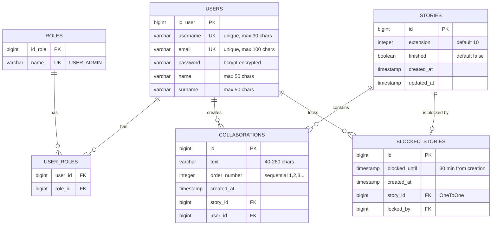
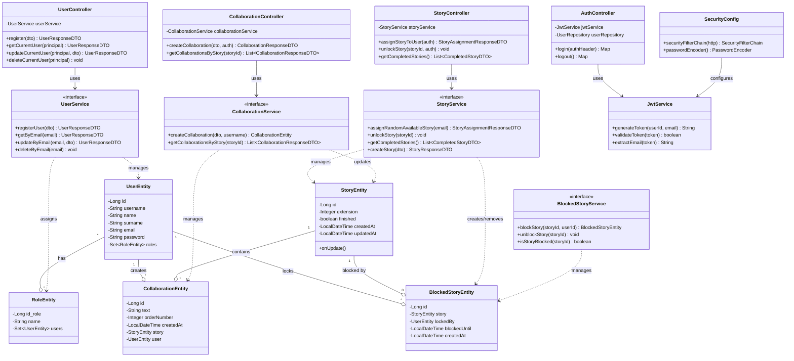

# 📖 Exquis - Collaborative Storytelling Game

## Backend repository

### See the frontend repository at: https://github.com/LinCarbajales/project-exquis-literary-app-front

<div align="center">


*Create unexpected and entertaining stories, one collaboration at a time.*

</div>

---

## 🎭 What is Exquis?

**Exquis** is a collaborative storytelling game inspired by the **Surrealist writing technique** "Cadavre Exquis" (Exquisite Corpse). Users contribute to stories knowing only the last collaboration, creating unexpected, disconnected, and often hilarious narratives.

### 🎯 The Game

1. **Get Assigned a Story** - The system assigns you a random available story
2. **See the Last Collaboration** - You only know the previous contributor's text
3. **Add Your Part** - Write 40-260 characters to continue the story
4. **Submit or Abandon** - Your story is locked for 30 minutes
5. **Discover Completed Stories** - Read full stories with all contributors revealed

---

## ✨ Features

### 📝 Collaborative Writing
- **Random Story Assignment** - Fair distribution algorithm
- **Limited Context** - See only the previous collaboration
- **Character Limits** - 40-260 characters per contribution
- **Non-Consecutive Participation** - Users must wait for 2 other collaborations before contributing again

### 🔒 Story Locking System
- **Automatic Locking** - Stories lock for 30 minutes when assigned
- **Timeout Protection** - Auto-unlock if user abandons or exceeds time limit
- **Expired Block Cleanup** - Automatic cleanup of expired locks
- **Concurrent User Support** - Multiple users can work on different stories simultaneously

### 👤 User Management
- **User Registration** - Email-based authentication
- **Profile Editing** - Update username, name, email
- **Account Deletion** - Collaborations reassigned to `@NoUser`
- **JWT Authentication** - Secure token-based auth with Basic Auth login

### 📚 Public Reading
- **Completed Stories** - View stories with 10+ collaborations
- **Twitter-like Format** - Visual thread display with avatars
- **Contributor Attribution** - See username of each collaborator
- **Chronological Order** - Collaborations displayed in sequence

---

## 🏗️ Architecture

### 🗄️ Entity Relationship



## 🏗️ Class Diagram



### Postman Endpoints


---

## 🚀 Installation

### Prerequisites

- **Java 17+**
- **Maven 3.8+**

### Quick Start

```bash
# Clone the repository
git clone https://github.com/yourusername/exquis.git
cd exquis

# Configure database (application.properties)
spring.datasource.url=jdbc:postgresql://localhost:5432/exquis
spring.datasource.username=your_username
spring.datasource.password=your_password

# Run the application
./mvnw spring-boot:run

# API available at http://localhost:8080/api
```

### Docker

```bash
docker compose up
```

---

## 📡 API Documentation

### Authentication

#### Login
```http
GET /api/login
Authorization: Basic base64(email:password)

Response:
{
  "token": "eyJhbGciOiJIUzI1NiIs...",
  "user": {
    "id_user": 1,
    "username": "john_doe",
    "email": "john@example.com"
  }
}
```

#### Logout
```http
GET /api/logout
Authorization: Bearer {token}
```

### User Endpoints

#### Register
```http
POST /api/users/register
Content-Type: application/json

{
  "username": "john_doe",
  "email": "john@example.com",
  "password": "securepass123",
  "name": "John",
  "surname": "Doe"
}
```

#### Get Current User
```http
GET /api/users/me
Authorization: Bearer {token}
```

#### Update Profile
```http
PUT /api/users/me
Authorization: Bearer {token}
Content-Type: application/json

{
  "username": "new_username",
  "name": "New Name"
}
```

#### Delete Account
```http
DELETE /api/users/me
Authorization: Bearer {token}
```

### Story Endpoints

#### Request Story Assignment
```http
POST /api/stories/assign
Authorization: Bearer {token}

Response:
{
  "storyId": 42,
  "extension": 10,
  "currentCollaborationNumber": 5,
  "previousCollaboration": {
    "text": "The mysterious door creaked open...",
    "user": { "username": "alice_writer" }
  },
  "timeLimit": 1800  // 30 minutes in seconds
}
```

#### Get Completed Stories
```http
GET /api/stories/completed
Authorization: Bearer {token}

Response:
[
  {
    "id": 1,
    "totalCollaborations": 10,
    "firstCollaboration": {
      "text": "Once upon a midnight dreary...",
      "user": { "username": "edgar_poe" }
    }
  }
]
```

#### Unlock Story (Abandon)
```http
POST /api/stories/unlock/{storyId}
Authorization: Bearer {token}
```

#### Submit Collaboration
```http
POST /api/collaborations
Authorization: Bearer {token}
Content-Type: application/json

{
  "text": "But little did they know, the cat was actually a wizard in disguise.",
  "storyId": 42
}

Response:
{
  "id": 123,
  "text": "But little did they know, the cat was actually a wizard in disguise.",
  "orderNumber": 5,
  "storyId": 42,
  "user": {
    "username": "john_doe",
    "name": "John",
    "surname": "Doe"
  }
}
```

#### Get Story Collaborations
```http
GET /api/collaborations/story/{storyId}
Authorization: Bearer {token}

Response:
[
  {
    "orderNumber": 1,
    "text": "In a land far away...",
    "user": { "username": "user1" }
  },
  {
    "orderNumber": 2,
    "text": "There lived a peculiar creature...",
    "user": { "username": "user2" }
  }
]
```

---


### 4️⃣ Read Completed Stories

```bash
curl -X GET http://localhost:8080/api/stories/completed \
  -H "Authorization: Bearer YOUR_JWT_TOKEN"
```

---

## 🧪 Testing

The project includes a comprehensive test suit

### Test Coverage

73.60%


### Run Tests

```bash
# Run all tests
./mvnw test

# Run specific test class
./mvnw test -Dtest=StoryServiceImplTest

# Run with coverage
./mvnw test jacoco:report

# View coverage report
open target/site/jacoco/index.html
```
---

## 🔐 Security Features

- **JWT Authentication** - Stateless token-based auth
- **Basic Auth Login** - Standard HTTP authentication for login endpoint

---

## 🎨 Business Rules

### Story Assignment Algorithm

1. **Clean Expired Blocks** - Remove locks older than 30 minutes
2. **Check User's Active Lock** - Return if user already has a story
3. **Filter Available Stories**:
   - Not finished (< 10 collaborations)
   - Not currently blocked by another user
   - User hasn't participated in last 2 collaborations
4. **Prioritize**:
   - Stories in progress (1-9 collaborations)
   - New stories (0 collaborations)
   - Create new story if none available
5. **Lock Story** - Block for 30 minutes

### Collaboration Rules

- **Length**: 40-260 characters
- **Order**: Sequential numbering (1, 2, 3...)
- **Auto-Completion**: Story marked as finished at 10th collaboration
- **Visibility**: Only last collaboration shown during assignment

### User Deletion

When a user deletes their account:
1. **NoUser Creation** - System creates `@NoUser` if doesn't exist
2. **Collaboration Reassignment** - All user's collaborations → `@NoUser`
3. **Data Preservation** - Stories remain intact with placeholder user
4. **Protection** - `@NoUser` account cannot be deleted

---

## 📊 Database Schema

```sql
┌─────────────┐       ┌──────────────────┐       ┌─────────────┐
│   users     │───────│  user_roles      │───────│   roles     │
├─────────────┤       ├──────────────────┤       ├─────────────┤
│ id_user (PK)│       │ user_id (FK)     │       │ id_role (PK)│
│ username    │       │ role_id (FK)     │       │ name        │
│ email       │       └──────────────────┘       └─────────────┘
│ password    │
│ name        │
│ surname     │
└─────────────┘
       │
       │ locked_by (FK)
       │
┌──────────────────┐       ┌─────────────────┐       ┌──────────────────┐
│ blocked_stories  │       │    stories      │       │ collaborations   │
├──────────────────┤       ├─────────────────┤       ├──────────────────┤
│ id (PK)          │───────│ id (PK)         │───────│ id (PK)          │
│ story_id (FK)    │       │ extension       │       │ text             │
│ locked_by (FK)   │       │ finished        │       │ order_number     │
│ blocked_until    │       │ created_at      │       │ story_id (FK)    │
│ created_at       │       │ updated_at      │       │ user_id (FK)     │
└──────────────────┘       └─────────────────┘       │ created_at       │
                                                      └──────────────────┘
```


## 🗺️ Roadmap

### Future Enhancements

- [ ] Social network features: follow users, user profile picture
- [ ] Internationalization

---


### Code Style

- Follow Java conventions
- Use Lombok annotations
- Write tests for new features

---

## 📄 License

This project is licensed under the MIT License - see the [LICENSE](LICENSE) file for details.

---

## 👥 Authors

- **Lin Carbajales** - (https://github.com/LinCarbajales)

---

## 🙏 Acknowledgments

- Inspired by the Surrealist movement's "Cadavre Exquis" technique
- Built with Spring Boot and modern Java practices

</div>
